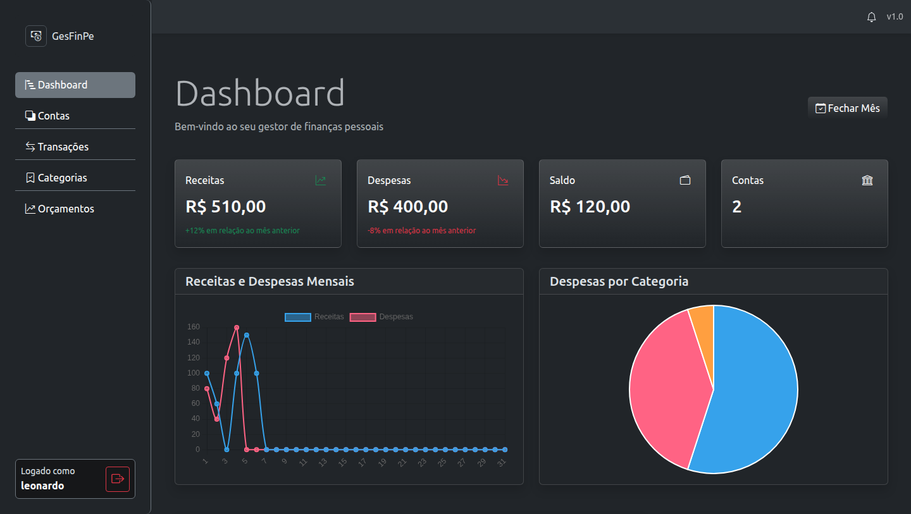
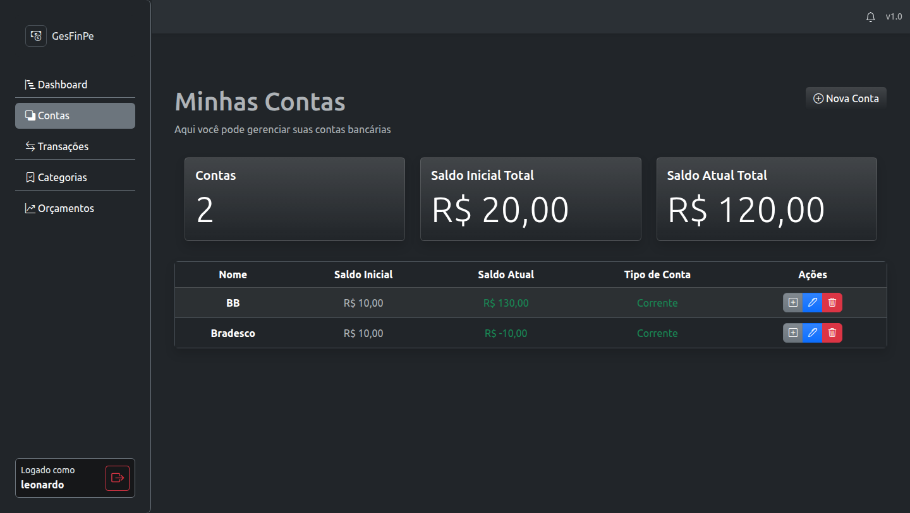
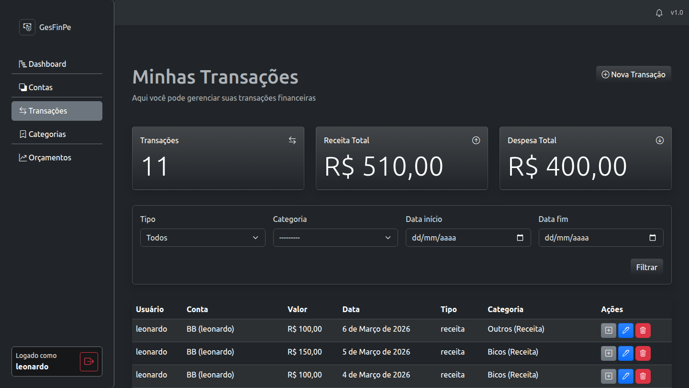
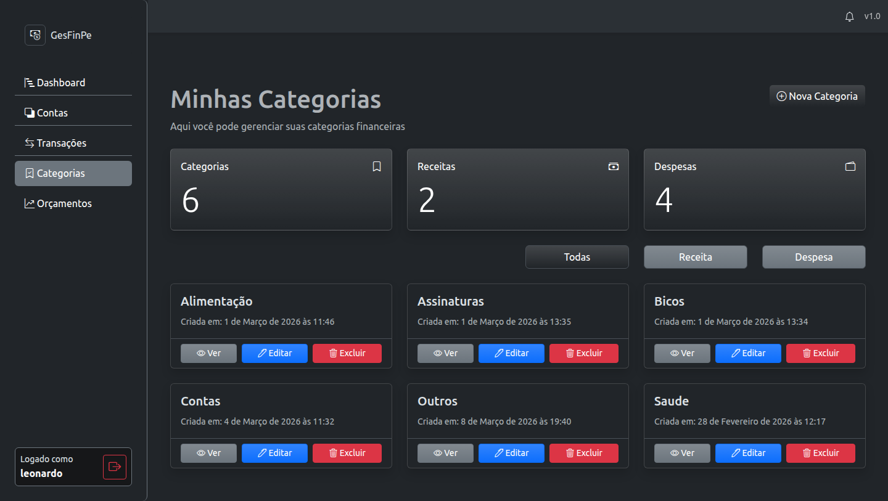
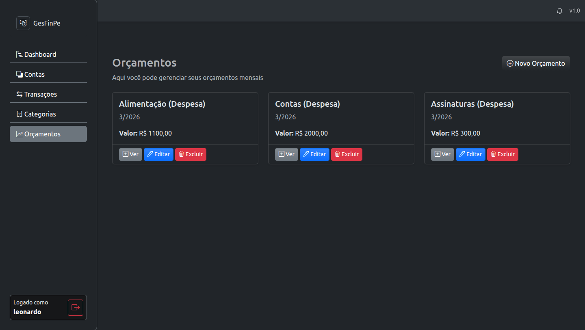

# Gestor de Finanças Pessoais

<p align="center">
    
    
</p>

<h2 align='center'>Tecnologias Utilizadas</h2>

<br>
<div align='center'>
    
    
    
    
    
    
</div>
<br>

## Descrição

Um gestor de finanças pessoais desenvolvido com Django que permite controlar receitas, despesas e acompanhar o orçamento pessoal de forma prática e eficiente.

## Como Executar

### Pré-requisitos
- Python 3.8+
- pip

### Passo a Passo

1. **Clone o repositório**
    ```bash
    git clone <url-do-repositorio>
    cd gestor-de-financas-pessoais
    ```

2. **Crie um ambiente virtual**
    ```bash
    python -m venv venv
    ```

3. **Ative o ambiente virtual**
    - No Windows:
      ```bash
      venv\Scripts\activate
      ```
    - No Linux/macOS:
      ```bash
      source venv/bin/activate
      ```

4. **Instale as dependências**
    ```bash
    pip install -r requirements.txt
    ```

5. **Execute as migrações**
    ```bash
    python manage.py makemigrations
    python manage.py migrate
    ```

6. **Inicie o servidor**
    ```bash
    python manage.py runserver
    ```

7. **Acesse a aplicação**
    Abra seu navegador e vá para `http://localhost:8000`

## Galeria de Fotos do Projeto

### Index


### Dashboard



### Contas



### Transações



### Categorias



### Orçamentos


